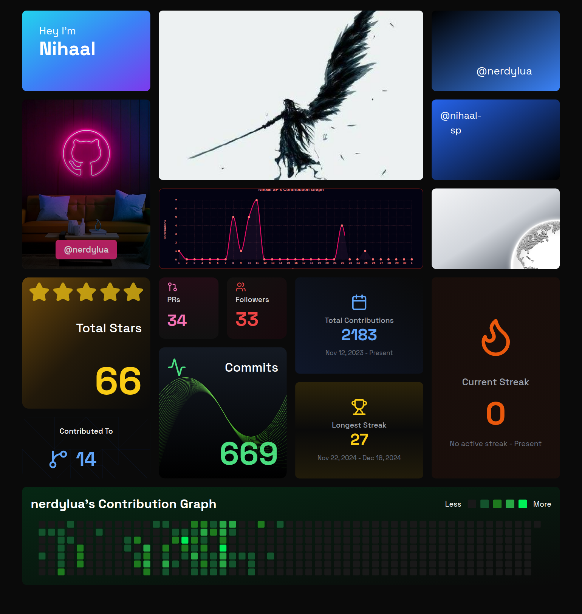

## About me
- I am a student focused on learning Web Development and Algorithms, with a dabble in Cybersec :)
- You can reach me at: nihaalsp7@gmail.com
  

## Languages and Tools :

  

## Github Stats

 

## Hacktoberfest badges

## My LeetCode Stats

